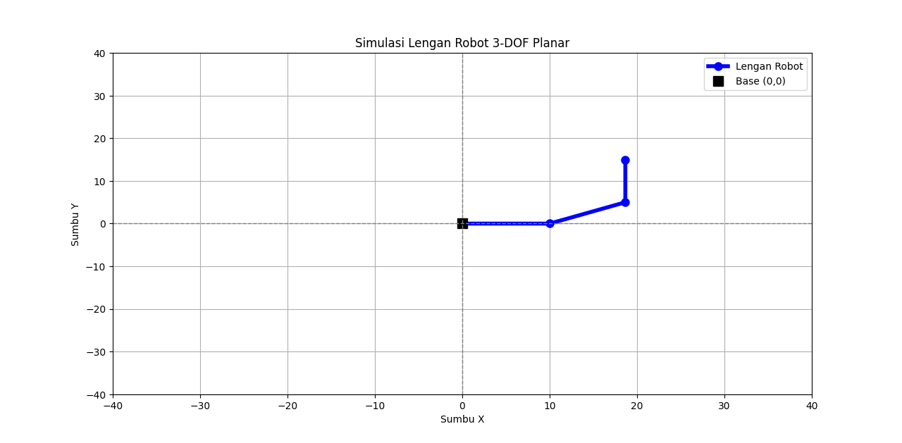
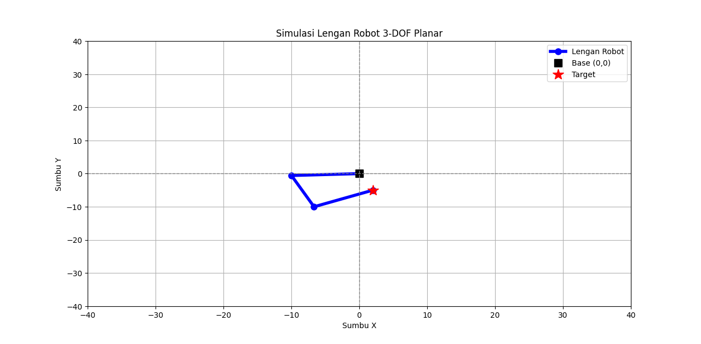

```markdown
# 🤖 3-DOF Planar Robot Arm Simulator

Simulator berbasis Python ini digunakan untuk memodelkan dan memvisualisasikan pergerakan lengan robot planar dengan 3 derajat kebebasan (3-DOF). Program ini mendukung perhitungan **Forward Kinematics (FK)** dan **Inverse Kinematics (IK)**, lengkap dengan visualisasi grafis menggunakan Matplotlib.

## ✨ Fitur
* **Forward Kinematics:** Menghitung posisi koordinat ujung lengan (End-Effector) berdasarkan sudut masing-masing sendi.
* **Inverse Kinematics:** Menghitung sudut yang dibutuhkan oleh masing-masing sendi untuk mencapai titik koordinat $(x, y)$ dan orientasi tertentu.
* **Visualisasi 2D:** Menampilkan plot grafis lengan robot secara proporsional.

## 🛠️ Prasyarat (Dependencies)
Pastikan kamu sudah menginstal library berikut sebelum menjalankan program:
- `numpy`
- `matplotlib`

Kamu bisa menginstalnya menggunakan pip:
```bash
pip install numpy matplotlib
```

## 🚀 Cara Penggunaan
1. Jalankan script Python melalui terminal atau command prompt:
   ```bash
   python nama_file_kamu.py
   ```
2. Masukkan panjang masing-masing link (L1, L2, L3) saat diminta.
3. Pilih mode operasi:
   - **Mode 1:** Masukkan nilai sudut ($\theta_1, \theta_2, \theta_3$) dalam derajat untuk melihat posisi akhir robot.
   - **Mode 2:** Masukkan target koordinat (X, Y) dan sudut orientasi ($\phi$) untuk mencari sudut sendi yang diperlukan.

---

## 🧮 Rumus Kinematika

### 1. Forward Kinematics (FK)
Forward Kinematics digunakan untuk mencari posisi End-Effector $(x, y)$ dan orientasinya $(\phi)$ jika diketahui panjang link $(L_1, L_2, L_3)$ dan sudut masing-masing sendi $(\theta_1, \theta_2, \theta_3)$.

Persamaan posisinya adalah:

$$x = L_1 \cos(\theta_1) + L_2 \cos(\theta_1 + \theta_2) + L_3 \cos(\theta_1 + \theta_2 + \theta_3)$$

$$y = L_1 \sin(\theta_1) + L_2 \sin(\theta_1 + \theta_2) + L_3 \sin(\theta_1 + \theta_2 + \theta_3)$$

Orientasi akhir End-Effector dihitung dengan menjumlahkan semua sudut:

$$\phi = \theta_1 + \theta_2 + \theta_3$$


### 2. Inverse Kinematics (IK)
Inverse Kinematics digunakan untuk mencari sudut sendi $(\theta_1, \theta_2, \theta_3)$ jika kita mengetahui target posisi akhir $(x, y)$ dan orientasi $(\phi)$ yang diinginkan. Metode yang digunakan adalah pendekatan aljabar dan trigonometri.

**Langkah 1: Mencari posisi *Wrist* (Pergelangan / Sendi 3)**
Karena panjang $L_3$ dan orientasi akhir $\phi$ diketahui, kita bisa mencari koordinat sendi pergelangan $(x_w, y_w)$:

$$x_w = x - L_3 \cos(\phi)$$

$$y_w = y - L_3 \sin(\phi)$$

**Langkah 2: Menghitung Sudut $\theta_2$**
Dengan menggunakan Aturan Cosinus pada segitiga yang dibentuk oleh Base, Sendi 2, dan Wrist:

$$\cos(\theta_2) = \frac{x_w^2 + y_w^2 - L_1^2 - L_2^2}{2 L_1 L_2}$$

Untuk mendapatkan nilai sudutnya (mengambil solusi *elbow-down*):

$$\sin(\theta_2) = \sqrt{1 - \cos^2(\theta_2)}$$

$$\theta_2 = \text{atan2}(\sin(\theta_2), \cos(\theta_2))$$

**Langkah 3: Menghitung Sudut $\theta_1$**
Untuk mencari $\theta_1$, kita mendefinisikan variabel bantu $k_1$ dan $k_2$:

$$k_1 = L_1 + L_2 \cos(\theta_2)$$

$$k_2 = L_2 \sin(\theta_2)$$

Sehingga nilai $\theta_1$ adalah:

$$\theta_1 = \text{atan2}(y_w, x_w) - \text{atan2}(k_2, k_1)$$

**Langkah 4: Menghitung Sudut $\theta_3$**
Karena orientasi akhir adalah jumlah dari semua sudut sendi ($\phi = \theta_1 + \theta_2 + \theta_3$), maka:

$$\theta_3 = \phi - \theta_1 - \theta_2$$

---

## 📸 Hasil Simulasi (Screenshots)

*Silakan ganti path/URL gambar di bawah ini dengan nama file screenshot kamu setelah menjalankan program.*

### Forward Kinematics
> Contoh hasil perhitungan posisi ujung ketika diberikan input sudut tertentu.



### Inverse Kinematics
> Contoh lengan robot mencapai titik target koordinat (ditandai dengan bintang merah).


